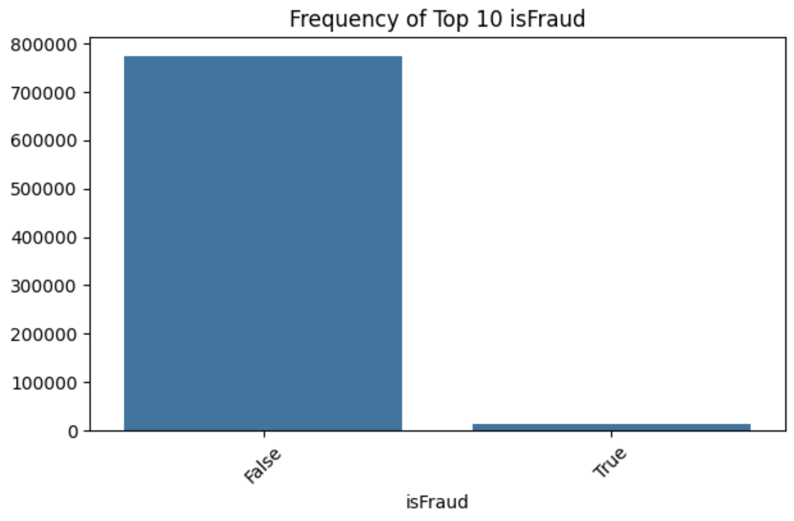

# Credit Card Fraud Detection

-   Author: Jenny Lee, Shawn X. Hu, Koray Tecimer, Iris Luo

Contains an analytical report generated for Milestone 1 of DSCI 522, a course offered through the Master of Data Science program at the University of British Columbia.

## About

Through this project, we attempted to build three classification models capable of distinguishing between fraud and non-fraud transactions, as indicated on customer accounts. Data preprocessing steps are also described in `fraud_detection.ipynb`. The models we experimented with include logistic regression, random forest classifier, and gradient boost classifier. Due to an extreme imbalance in our data, we encountered challenges in developing an effective model in milestone 1. In the discussion, we have provided some suggestions for future steps.

## Data

Our data is sourced from the [Capital One GitHub for Data Scientist Recruitment](https://github.com/CapitalOneRecruiting/DS). The data consists of 786,363 entries of synthetically generated data.



As depicted in the graph above, our dataset exhibits a significant imbalance. The imbalanced nature of the data significantly affected the performance of our models, preventing them from achieving a high scoring metric value (f1).

## Usage

Below are the packages along with their detailed versions used in this project. To run the project, copy and paste the code provided into your local terminal.

```         
conda env create —f environment.yml
```

To run the project, copy and paste the commands below into your local terminal from the project's root directory.

```         
conda activate 522group14
jupyter lab
```

Click on the `Run All` button once Jupyter Lab has been successfully launched.

## Dependencies

-   `conda` (version 23.7.4 or higher)
-   `nb_conda_kernels` (version 2.3.1 or higher)
-   Python packages listed in `environment.yml`.

## License
Licenses used in this project are listed below. More detailed information can be found at `LICENSE.md`. 
- MIT License
- Copyright (c) 2023 Master of Data Science at the University of British Columbia

## Disclaimer

The overall format of `README.md` is retrieved from the [sample project repository](https://github.com/ttimbers/breast_cancer_predictor_py/tree/0.0.1).

## References

Capital One. (2018). Capital One Data Science Challenge. In *CapitalOneRecruiting GitHub Repository*. <https://github.com/CapitalOneRecruiting/DS>

Python Software Foundation. Python Language Reference, version 3.11.6. Available at <http://www.python.org>

Timbers, T., Lee, M. & Ostblom, J. (2023). Breast Cancer Predictor. <https://github.com/ttimbers/breast_cancer_predictor_py/tree/0.0.1>

Pedregosa, F., Varoquaux, Ga"el, Gramfort, A., Michel, V., Thirion, B., Grisel, O., ... others. (2011). Scikit-learn: Machine learning in Python. Journal of Machine Learning Research, 12(Oct), 2825--2830

McKinney, W., & others. (2010). Data structures for statistical computing in python. In Proceedings of the 9th Python in Science Conference (Vol. 445, pp. 51--56).

Caporal, J. (2023). Identity Theft and Credit Card Fraud Statistics for 2023. In *the Ascent*. <https://www.fool.com/the-ascent/research/identity-theft-credit-card-fraud-statistics/>
